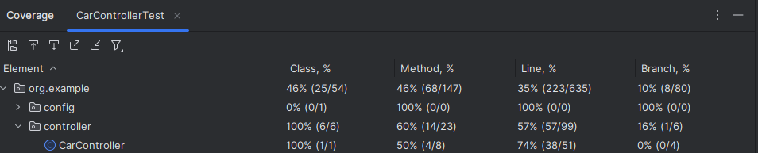
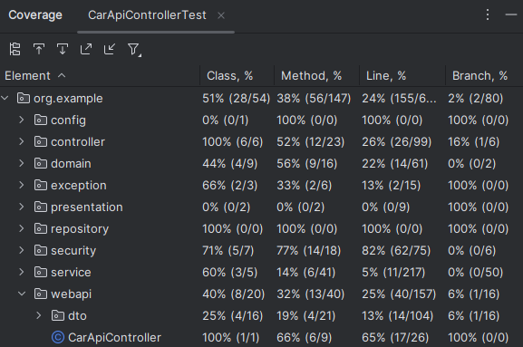
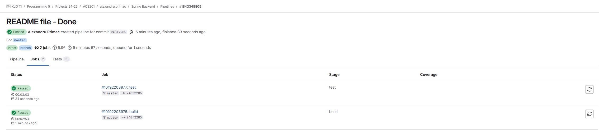
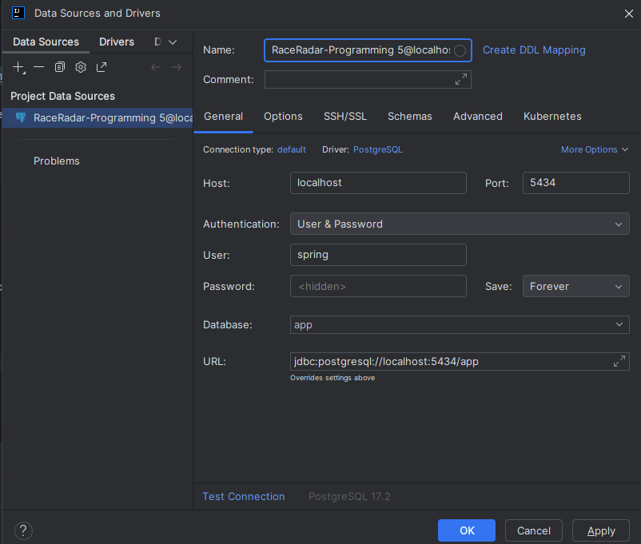

# Programming5-Project-Primac-Alexandru

## Author
**Name:** Alexandru Primac

**Student ID:** 0159060-77

**email:** alexandru.primac@student.kdg.be

**Class:** ACS201

**Academic Year:** 2025

---

## Domain Explanation and Relations Between Entities
### Domain Overview:
This project models a racing ecosystem with entities such as Cars, Races, and Sponsors. The application manages cars, their participation in races, and their sponsorships.

### Entity Relationships:
1. **Cars**:
   - Participate in multiple races (Many-to-Many relationship with Races).
   - Have multiple sponsors (Many-to-Many relationship with Sponsors).

2. **Races**:
   - Feature multiple cars (Many-to-Many relationship with Cars).

3. **Sponsors**:
   - Can sponsor multiple cars (Many-to-Many relationship with Cars).


---

## Week 2 & Week 3 API

### Filtering Cars by Brand - OK

```
GET http://localhost:8080/api/cars?brand=ferrari
Accept: application/json

Json Response:
HTTP/1.1 200 OK
[{"id":1,"brand":"Ferrari","model":"488 GTB","engine":3.9,...}]
```
### Filtering Cars by Brand - OK(empty list)
```
GET http://localhost:8080/api/cars?brand=Citroen
Accept: application/json

Json Response:
HTTP/1.1 200
Content-Type: application/json
Transfer-Encoding: chunked
Date: Thu, 06 Mar 2025 19:46:09 GMT
[]
```
### Deleting Car with id 1 - 204 No Content

```
DELETE http://localhost:8080/api/cars/1

Json Response:
HTTP/1.1 204
<Response body is empty>
```

### Deleting Car with id 999 - 404 Not Found

```
DELETE http://localhost:8080/api/cars/999

Json Response:
HTTP/1.1 404 Not Found
{"error":"Car not found"}
```

### Creating New Car - 201 Created
```
POST http://localhost:8080/api/cars
Accept: application/json
Content-Type: application/json

{
"brand": "Toyota",
"model": "Corolla",
"engine": 1.8,
"horsePower": 130,
"year": 2020,
"category": "SPORTS"
}

Json Response:
HTTP/1.1 201 Created
{"id":2,"brand":"Toyota","model":"Corolla",...}
```

### Partial Car Update - 200 OK
```
PATCH http://localhost:8080/api/cars/1
Accept: application/json
Content-Type: application/json

{"horsepower": 630}

Json Response:
HTTP/1.1 200 OK
{"id":1,"horsepower":630,...}
```

### Partial Car Update - 404 NOT FOUND (id not found)
```
PATCH http://localhost:8080/api/races/100
Accept: application/json
Content-Type: application/json

{
"name": "Monaco Grand Prix",
"date": "2023-01-29",
"track": "Monaco Grand Prix",
"location": "Monaco",
"distance": 9.0
}

Json Response:
HTTP/1.1 404 
Content-Length: 0
<Response body is empty>
```

### Adding Race to Car - 200 ok
```
PATCH http://localhost:8080/api/cars/1/add-race?raceId=12
Accept: application/json
Content-Type: application/json

Json Response:
HTTP/1.1 200
Content-Type: application/json
Transfer-Encoding: chunked
Date: Thu, 06 Mar 2025 19:54:06 GMT

{
"id": 1,
"brand": "Ferrari",
"model": "488 GTB",
"image": "ferrari.jpg",
"races": [
{
"id": 1,
"name": "Monaco Grand Prix",
"date": "2023-05-28",
"location": "Monaco",
"image": "monaco.jpg",
"track": "Monaco Grand Prix"
},
{
"id": 3,
"name": "Nurburgring Endurance",
"date": "2023-08-10",
"location": "Germany",
"image": "nurburgring.jpg",
"track": "Nurburgring"
},
{
"id": 12,
"name": "NHRA Nationals",
"date": "2024-03-15",
"location": "USA",
"image": "nhra.jpg",
"track": "Las Vegas Motor Speedway"
}]}
```

---

## Week 4 & 5 Security

### Users:
1. **alexandru@gmail.com**:
   - Password: alex1234

This user has the "USER_ROLE" and can only access the following pages:
```
   - http://localhost:8080/, http://localhost:8080/register, http://localhost:8080/cars, http://localhost:8080/races, http://localhost:8080/sponsors, http://localhost:8080/carDetails, http://localhost:8080/raceDetails, http://localhost:8080/user/details
```
   - The users with this role can't add races or sponsors. They also don't have access to modify the information from these entities.
   - The user is able to add a car, and he/she will be linked to that specific car to modify and delete it. He can add a race or a sponsor to the car he is linked to.


2. **sponge@gmail.com**:
   - Password: sponge1234

This user has the "USER_ADMIN" and can access every page:
   - The users with this role can access and modify everything. 

3. **Guest users (unauthenticated):**

Guests can only access the following pages:
```
   - http://localhost:8080/, http://localhost:8080/register, http://localhost:8080/cars, http://localhost:8080/races, http://localhost:8080/sponsors
```
   - The functionality of these pages is limited, they don't have the filter feature and they are not able to inspect the details of the entities.


4. **Registered Users:**

There is the functionality to register and create a user. Every user created is automatically assigned with the "USER_ROLE". 
```
   - http://localhost:8080/register
```

---

### CSRF Protection
CSRF tokens are automatically generated by Spring Security and embedded in HTML pages as <meta> tags:
```
   <meta name="_csrf" th:content="${_csrf.token}"/>
   <meta name="_csrf_header" th:content="${_csrf.headerName}"/>
   ```
JavaScript reads these tokens and attaches them to fetch() requests using the appropriate header.

Add car example (addCar.js):
```
const response = await fetch('http://localhost:8080/api/cars', {
method: 'POST',
headers: {
'Accept': 'application/json' ,
[csrfHeaderName]: csrfToken ,
'Content-Type': 'application/json'
},
body: jsonBody
});
```
---
## Week 6 Tests
In week 6 I created Repository and Service Tests. I use the **test** spring profile so that the seeding routine doesn't interfere with my tests. Tests run consistently and not interfere with the production data. 

Command for runnning all the tests:
```bash
./gradlew test
```

CarRepositoryTest - 7 tests

RaceRepositoryTest - 2 tests

CarServiceTest - 18 tests
```
60% methods 
53% lines covered
```

---
## Week 8 Integration Tests
In week 8 I created MVC and API integration tests. 

MVC Classic Integration Tests - CarControllerTest:
```
5 tests
50% methods 
74% lines covered
```

Role verification tests in CarControllerTest:
```
Test Name	                           Role Being Verified      Access Granted?
shouldShowAdminCarDetails	                 Admin	                 Yes
shouldAllowUserToViewCarDetails	                 Admin	                 Yes
shouldNotAllowAnonymousUserToViewCarDetails  Normal User (Owner)         Yes
```

API Integration tests - CarApiControllerTest: 
```
13 tests
66% methods 
65% lines covered
```


For these tests, I mocked the car service and the authorization service. I am testing the controller logic.

Role verification tests in CarApiControllerTest:
```
Test Name	             Role Being Verified      Access Granted?
shouldAllowAdminToUpdateCar	  Admin	                   Yes
shouldAllowAdminToDeleteCar	  Admin	                   Yes
shouldAllowOwnerToUpdateCar	  Normal User (Owner)      Yes
shouldAllowOwnerToDeleteCar	  Normal User (Owner)      Yes
```

---
## Week 10 Unit Test
In  week 10 I created mock tests for the car service and the car api controller. 

CarServiceUnitTest - 15 tests
```
80% methods 
65% lines covered
```
Verify Tests in CarServiceUnitTest:
```
Test Name	                        'verify' Used?	         Notes
shouldReturnCarsIfFilteredByBrand            Yes	                  Verifies brand query
shouldRemoveCar	                             Yes	                  Verifies deletions
shouldThrowExceptionIfCarDoesNotExist        Yes	                  Ensures no deletion attempted
shouldFindRacesWhenCarExists	             Yes	                  Verifies race fetch
shouldReturnEmptyListWhenCarDoesNotExist     Yes	                  Verifies race fetch (empty case)
shouldReturnSponsorsWhenCarExists	     Yes	                  Verifies sponsor fetch
shouldReturnEmptyListWhenCarNotFound	     Yes	                  Verifies sponsor fetch (empty case)
shouldPatchAllFieldsOfCar	             Yes	                  Verifies save
shouldPatchOnlySomeFieldsOfCar	             Yes	                  Verifies save
```

CarApiControllerUnitTest - 8 tests
```
55% methods 
57% lines covered
```
Verify Tests in CarServiceUnitTest:
```
Test Name	                        'verify' Used?	            Notes
shouldRemoveCarSuccessfully	              Yes            Verifies car deletions
```
Continuous integration pipeline:

https://gitlab.com/kdg-ti/programming-5/projects-24-25/acs201/alexandru.primac/spring-backend/-/pipelines/1843348805/builds



---
## Week 12 NPM Gradle Integration
In week 12 I integrated npm and webpack following the 13-step process.
I addded:
 - ESlint and dprint 
 - Bootstrap icons (every icon from the website is boostrap)
 - Joi Client side Form validation for both forms (adding a car and adding a race):
```
addCar.js
addRace.js
```
 - Axios HTTP for better error handling in the API responses (js):
```
adding a car or a race:
deleting a car, race or sponsor:
addCar.js
addRace.js
cars.js
races.js
sponsors.js

```
 - Animejs for animations when editing a car and race (green glowing card after clicking save) and animation when deleting a sponsor:
```
cars.js
races.js
sponsors.js
```


---
## Instructions to Run the Project
### Prerequisites:
1. **Java 21**

### Steps:
1. Clone the repository:
```bash
git clone https://gitlab.com/AlexandruPrimac/programmingalexandruprimac-client.git
```
2. Run the docker compose.yaml file and open docker application.


3. Add the PostgreSQL data source.

User and password: **spring**


4. Install Dependencies
```bash
npm install
```
```bash
npm run build
```
5. Compile code, run tests, and packages of the project:
```bash
./gradlew build
```
6. Run all tests separately
```bash
./gradlew test
```